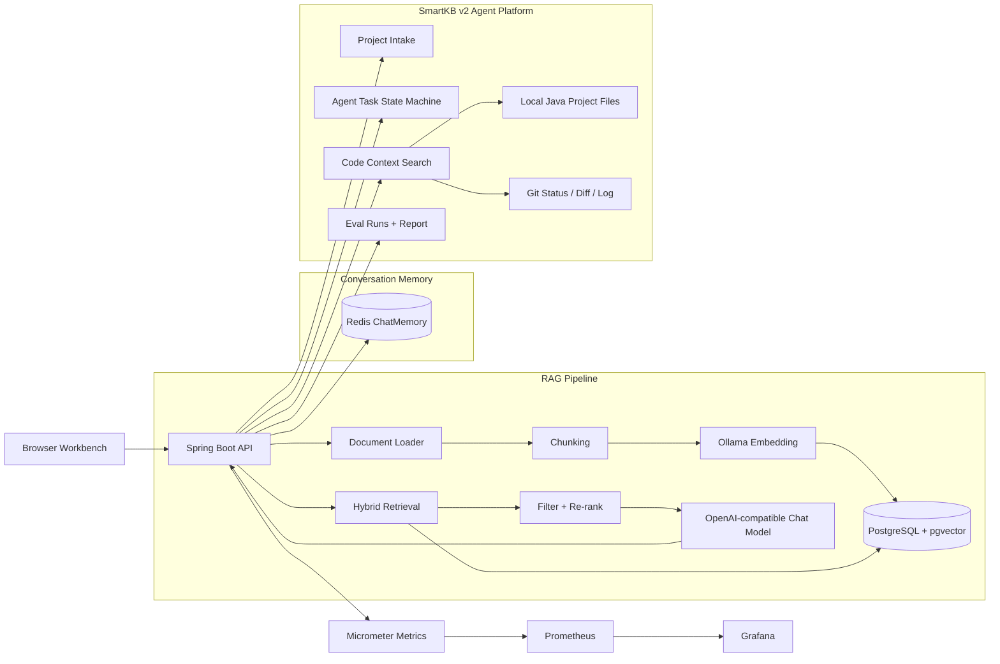

# SmartKB

Java 21 + Spring AI 企业智能知识库系统，已升级为面向 Java 存量项目的 Agent 工程平台。

SmartKB 的第一阶段是一个可运行、可演示、可监控的 Advanced RAG 知识库：文档上传、解析、切片、Embedding、pgvector 检索、多轮流式问答、引用片段和 Redis 会话记忆。第二阶段在此基础上扩展为 Agent 工程平台：项目接管、任务状态机、分层记忆、代码上下文检索和 Eval 评测。

## 项目亮点

- **Advanced RAG 闭环**：文档上传、UTF-8 解析、切片、Ollama Embedding、pgvector 入库、Hybrid Search、查询改写、过滤、重排序和引用片段定位。
- **Redis ChatMemory**：自研实现 Spring AI `ChatMemory` 接口，Redis List + TTL 持久化多轮会话，支持服务重启后恢复上下文。
- **流式对话体验**：普通对话和 Advanced RAG 都支持 SSE 流式返回；Advanced 模式展示查询改写、检索、过滤、重排、生成等阶段反馈。
- **可观测性**：Micrometer 自定义 Counter/Timer，Prometheus 指标采集，Grafana Dashboard 预配置。
- **Docker Compose 一键运行**：PostgreSQL + pgvector、Redis、Spring Boot、Prometheus、Grafana 一套 Compose 启动。
- **Agent 工程平台**：面向 Java 项目目录做接管摘要、任务状态流转、记忆分层、代码检索和 Eval 报告，使用 TicketRush 作为真实评测样本。

## 技术栈

| 分类 | 技术 |
| --- | --- |
| Runtime | Java 21, Spring Boot 3.3.1, Virtual Threads |
| AI | Spring AI 1.0.0-M1, OpenAI-compatible Chat API, Ollama `nomic-embed-text` |
| RAG | pgvector, Hybrid Search, Query Rewriting, Metadata Filtering, Re-ranking |
| Storage | PostgreSQL 16, Redis 7 |
| Observability | Spring Boot Actuator, Micrometer, Prometheus, Grafana |
| Delivery | Docker Compose, Docker BuildKit, K3s demo manifest |
| Test | JUnit 5, Mockito, Spring MVC Test, Testcontainers profile |

## 架构图



## 功能清单

### RAG 知识库

- 文档上传：Markdown、TXT、PDF、DOCX。
- 文档管理：列表、详情、删除、统计。
- 文档切片可视化：查看入库 chunk，引用片段可定位到文档详情。
- 普通问答：多轮对话、流式输出、会话 ID 管理。
- Advanced RAG：查询改写、双路召回、文档过滤、关键词/锚点重排、阶段耗时指标。
- Redis 会话记忆：刷新或重启应用后，同一 `conversationId` 可恢复上下文。

### Agent 工程平台

- 项目接管：读取 `README/SPEC/AGENTS/HANDOFF/pom.xml/docker-compose.yml/Git` 信息，生成接管摘要和指标速览。
- 任务状态机：`INTAKE -> PLAN -> EXECUTE -> VERIFY -> RECORD`，记录状态流转和验证结果。
- 记忆分层：高权威记忆、中权威记忆、低权威记忆，工作台支持导入、手工新增、列表查看和冲突提示。
- 代码上下文：文件树、关键词搜索、Git diff、代码 chunk、语义检索，并展示结果数、跳过数、警告和 Git 状态。
- Eval 评测：记录 TicketRush eval case，聚合成功率、得分率、失败原因和人工介入指标。

## 快速启动

### 方式一：Docker Compose 全链路

准备 `.env`：

```bash
cp .env.example .env
```

填入你的 Chat API 配置，示例字段：

```env
TRANSIT_API_KEY=your-chat-api-key
TRANSIT_BASE_URL=https://api.deepseek.com
AI_MODEL=deepseek-chat
SMARTKB_PROJECTS_ROOT=..
```

启动：

```bash
docker compose up -d
```

访问：

| 服务 | 地址 |
| --- | --- |
| SmartKB | http://localhost:8082 |
| Grafana | http://localhost:3001 |
| Health | http://localhost:8082/actuator/health |

Docker 模式下 Project Intake 使用容器路径：

```text
/workspace/projects/<project-dir>
```

例如：

```text
/workspace/projects/smartkb-java21-spring-ai-rag
```

### 方式二：Hybrid 本地开发

只启动 PostgreSQL 和 Redis：

```bash
docker compose -f docker-compose-minimal.yml up -d
```

准备 Ollama Embedding 模型：

```bash
ollama pull nomic-embed-text
```

IDEA 或命令行启动 Spring Boot：

```text
Active profiles: hybrid
Environment variables:
TRANSIT_API_KEY=your-chat-api-key;TRANSIT_BASE_URL=https://api.deepseek.com;AI_MODEL=deepseek-chat
```

访问：

```text
http://localhost:8080
```

完整启动细节见 [STARTUP.md](STARTUP.md)。

## 演示路径

推荐演示文档：

```text
test-docs/advanced-rag-demo.md
```

5 分钟演示：

1. 打开 SmartKB 工作台。
2. 上传 `advanced-rag-demo.md`。
3. 查看文档详情和 chunk。
4. 在“智能问答”中进行多轮流式问答。
5. 切换 Advanced 模式，选择指定文档，提问：

```text
查询改写在 Advanced RAG 中解决什么问题？
为什么引用片段能提升 RAG 系统可信度？
```

6. 展开引用片段并定位到文档详情 chunk。
7. 切到“项目接管”，输入 Docker 容器内项目路径，运行 Project Intake。
8. 查看“任务状态”“记忆层”“代码上下文”“Eval 评测”工作区。

详细脚本见 [DEMO.md](DEMO.md)。

## API 概览

### 文档与问答

| 方法 | 路径 | 说明 |
| --- | --- | --- |
| `POST` | `/api/documents/upload` | 上传文档并生成向量 |
| `GET` | `/api/documents` | 文档列表 |
| `GET` | `/api/documents/{fileName}` | 文档详情和 chunks |
| `DELETE` | `/api/documents/{fileName}` | 删除文档和向量 |
| `POST` | `/api/chat/conversation/stream` | 普通多轮流式对话 |
| `POST` | `/api/chat/advanced/stream` | Advanced RAG 分阶段流式回答 |
| `DELETE` | `/api/chat/memory/{conversationId}` | 清理 Redis 会话记忆 |

### Agent 平台

| 方法 | 路径 | 说明 |
| --- | --- | --- |
| `POST` | `/api/agent/projects/intake` | 项目接管摘要 |
| `POST` | `/api/agent/tasks` | 创建 Agent 任务 |
| `POST` | `/api/agent/tasks/{id}/transition` | 状态流转 |
| `GET` | `/api/agent/memories` | 记忆列表 |
| `POST` | `/api/agent/memories` | 创建分层记忆 |
| `POST` | `/api/agent/memories/import/high-authority` | 导入高权威记忆 |
| `POST` | `/api/agent/memories/conflicts/check` | 检查记忆冲突 |
| `POST` | `/api/agent/code/search` | 代码关键词搜索 |
| `POST` | `/api/agent/code/diff` | Git diff 检索 |
| `POST` | `/api/agent/code/semantic` | 语义补充检索 |
| `POST` | `/api/agent/eval/runs` | 创建 Eval Run |
| `GET` | `/api/agent/eval/report` | Eval 聚合报告 |

## 验证状态

当前已验证：

- `mvn test`：102 tests passed。
- Docker Compose 全链路启动：`smartkb-app` healthy。
- Redis ChatMemory live checklist：6/6 通过。
- Docker BuildKit 缓存构建：缓存命中后重建约秒级。
- Project Intake Docker 宿主机只读挂载：通过容器路径读取项目。
- Eval Run：内存存储、JDBC 持久化和 Testcontainers profile 已覆盖。
- 工作台浏览器 smoke：桌面端和 390px 移动视口均覆盖 6 个工作区切换，移动端无横向溢出。
- 移动端表单 smoke：Project Intake、Code Context、AgentTask 和 Eval 均已在 390px 视口通过。
- 工作台摘要指标 smoke：`node .\scripts\smoke\workbench-summary-smoke.mjs` 已覆盖 Project Intake / Code Context 指标渲染和横向溢出检查。

说明：

- Testcontainers 集成测试在部分 Windows Docker Desktop 环境中可能因为 npipe Java Docker client 配置被跳过。
- K3s demo manifest 已做 YAML 语法检查，仍建议在一次性 K3s/K3d 集群中再做真实部署验证。

## 项目结构

```text
src/main/java/com/smartkb
├── agent                 # SmartKB v2 Agent 工程平台
│   ├── application       # 接管、任务、记忆、代码上下文、Eval 服务
│   ├── controller        # Agent REST API
│   ├── domain            # AgentTask、MemoryRecord、EvalRun 等模型
│   └── infrastructure    # 文件系统与 Git 读取
├── config                # Spring AI、Redis ChatMemory、VectorStore、异常处理
├── controller            # 文档与问答 API
├── domain                # RAG 领域模型
├── service               # 文档加载、RAG、Advanced RAG、指标
└── util                  # Virtual Thread 诊断工具
```

## 面试讲法

30 秒版：

```text
SmartKB 是我做的 Java 21 + Spring AI 企业知识库项目，第一阶段完成了 Advanced RAG 工程闭环：文档上传、Ollama Embedding、pgvector 检索、Redis 会话记忆、流式问答和 Prometheus/Grafana 监控。第二阶段我把它升级成 Java 项目的 Agent 工程平台，能接管真实项目目录，做任务状态流转、记忆分层、代码上下文检索和 Eval 评测。我用 TicketRush 这个高并发票务项目作为真实样本来验证它。
```

核心追问点：

- 为什么 Redis ChatMemory 比 InMemoryChatMemory 更适合演示分布式和重启恢复？
- Advanced RAG 中查询改写、过滤和重排序分别解决什么问题？
- 为什么代码上下文检索不能只靠向量检索，而要优先 `rg`、Git diff 和文件树？
- 如何用 Eval Run 证明 Agent 能稳定接管真实 Java 项目？
- Java 21 Virtual Threads 在文档解析、Embedding、数据库访问和模型调用这类 IO 密集场景中的价值是什么？

更完整讲法见 [docs/EVAL_INTERVIEW_SUMMARY.md](docs/EVAL_INTERVIEW_SUMMARY.md) 和 [SPEC.md](SPEC.md)。

## 文档导航

| 文档 | 说明 |
| --- | --- |
| [STARTUP.md](STARTUP.md) | 本地启动指南 |
| [DEMO.md](DEMO.md) | 5 分钟演示脚本 |
| [TESTING.md](TESTING.md) | 测试指南 |
| [SPEC.md](SPEC.md) | 当前规格、进度和面试讲法 |
| [docs/AGENT_PLATFORM_SPEC.md](docs/AGENT_PLATFORM_SPEC.md) | SmartKB v2 Agent 平台规格 |
| [docs/REDIS_CHAT_MEMORY_VERIFICATION.md](docs/REDIS_CHAT_MEMORY_VERIFICATION.md) | Redis 会话记忆验证记录 |
| [docs/PROJECT_INTAKE_API_DESIGN.md](docs/PROJECT_INTAKE_API_DESIGN.md) | Project Intake 设计 |
| [docs/CODE_CONTEXT_API_DESIGN.md](docs/CODE_CONTEXT_API_DESIGN.md) | 代码上下文设计 |
| [docs/EVAL_RUN_PERSISTENCE_DESIGN.md](docs/EVAL_RUN_PERSISTENCE_DESIGN.md) | Eval Run 持久化方案 |
| [docs/K3S_DEPLOYMENT_PLAN.md](docs/K3S_DEPLOYMENT_PLAN.md) | K3s 部署方案 |
| [k8s/README.md](k8s/README.md) | Kubernetes/K3s 清单说明 |

## 安全说明

- `.env` 已加入 `.gitignore`，不要提交真实 API Key。
- `.env.example` 只保留占位字段和公开示例。
- 检查配置时只说明字段是否存在，不复述密钥值。
- Docker Compose 中的数据库账号密码仅用于本地演示环境，不用于生产。
