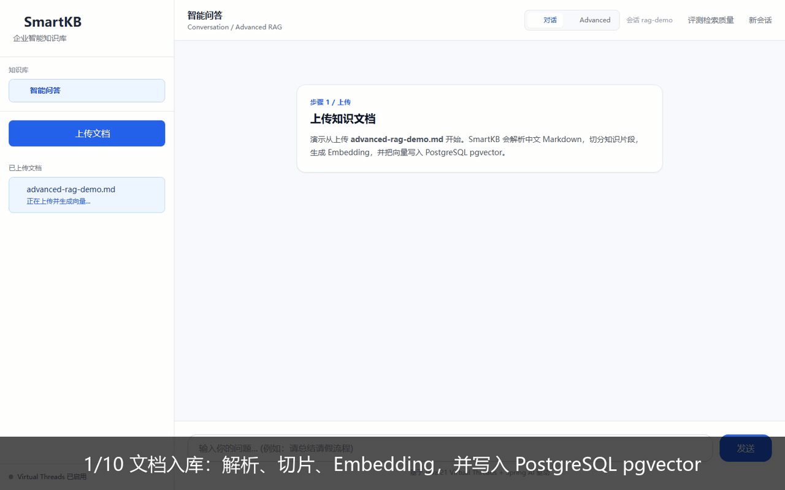
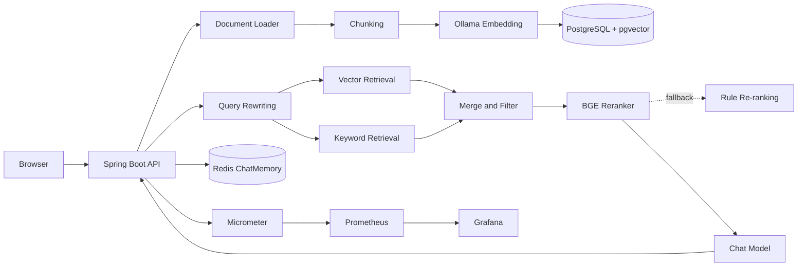

# SmartKB

SmartKB 是一个基于 Java 21、Spring Boot、Spring AI、PostgreSQL/pgvector 和 Redis 构建的可解释 RAG 知识库。

项目重点不是“接一个大模型接口”，而是实现一条可运行、可评测、可观测的 RAG 工程闭环：

```text
文档上传 → 解析与切片 → Embedding → pgvector
→ 查询改写 → Hybrid Search → 过滤与重排
→ 证据置信度判断 → 流式生成/拒答 → 引用定位 → 检索与答案质量评测
```



## 核心亮点

- **Advanced RAG**：查询改写、向量与关键词双路召回、文档过滤、BGE 模型重排和引用片段定位。
- **本地 GPU Reranker**：使用 `BAAI/bge-reranker-v2-m3` 进行 Cross-Encoder 重排，并通过排名融合保留规则信号；服务异常时自动降级到规则重排。
- **可量化评测**：内置中文测试集，对比普通检索和 Advanced RAG 的 Recall@K、Top1、MRR 与引用覆盖率。
- **低置信度拒答**：检索证据不足时跳过生成模型，返回明确拒答原因，降低无依据回答风险。
- **答案质量 Judge**：离线评估 Faithfulness、Answer Relevance 与 Context Relevance，并保留每项评分理由。
- **Redis 会话记忆**：实现 Spring AI `ChatMemory`，使用 Redis List + TTL 保存多轮上下文，并支持不可用时降级。
- **Java 21 虚拟线程**：用于文档解析和 Embedding 批处理等 IO 密集任务。
- **流式交互**：普通问答和 Advanced RAG 均支持 SSE；Advanced 模式会返回各阶段状态和耗时。
- **可观测性**：Micrometer 指标、Prometheus 采集和 Grafana Dashboard。
- **工程交付**：Docker Compose、K3s 演示清单、单元测试和浏览器 smoke 脚本。

## 技术栈

| 分类 | 技术 |
| --- | --- |
| Runtime | Java 21, Spring Boot 3.3.1 |
| AI | Spring AI, OpenAI-compatible Chat API, Ollama Embedding |
| Retrieval | pgvector, Hybrid Search, Query Rewriting, Metadata Filter |
| Storage | PostgreSQL 16, Redis 7 |
| Streaming | SSE / Reactor Flux |
| Observability | Actuator, Micrometer, Prometheus, Grafana |
| Delivery | Docker Compose, K3s |
| Test | JUnit 5, Mockito, Spring MVC Test |

## 架构


```mermaid
flowchart LR
    Browser[Browser] --> API[Spring Boot API]
    API --> Loader[Document Loader]
    Loader --> Splitter[Chunking]
    Splitter --> Embedding[Ollama Embedding]
    Embedding --> PG[(PostgreSQL + pgvector)]

    API --> Rewrite[Query Rewriting]
    Rewrite --> Vector[Vector Retrieval]
    Rewrite --> Keyword[Keyword Retrieval]
    Vector --> Merge[Merge and Filter]
    Keyword --> Merge
    Merge --> Rerank[BGE Reranker]
    Rerank -. fallback .-> Rule[Rule Re-ranking]
    Rerank --> LLM[Chat Model]
    LLM --> API

    API --> Redis[(Redis ChatMemory)]
    API --> Metrics[Micrometer]
    Metrics --> Prometheus
    Prometheus --> Grafana
```

## 快速启动

### 1. 准备配置

```bash
cp .env.example .env
```

填写 Chat API 配置。不要提交真实密钥。

### 2. 启动完整环境

```bash
docker compose up -d
```

| 服务 | 地址 |
| --- | --- |
| SmartKB | http://localhost:8082 |
| Health | http://localhost:8082/actuator/health |
| Grafana | http://localhost:3001 |

也可以只启动 PostgreSQL 和 Redis，然后使用 `hybrid` profile 在本地运行 Spring Boot，详见 [STARTUP.md](STARTUP.md)。

## 推荐演示路径

使用 `test-docs/advanced-rag-demo.md`：

1. 上传文档并查看切片结果。
2. 普通模式进行流式问答和多轮追问。
3. Advanced 模式指定文档提问。
4. 展示查询改写、召回、过滤、重排和生成阶段。
5. 点击引用片段定位原文 chunk。
6. 运行内置评测，对比普通检索与 Advanced RAG。

完整话术见 [DEMO.md](DEMO.md)。

## API

| 方法 | 路径 | 说明 |
| --- | --- | --- |
| `POST` | `/api/documents/upload` | 保存原文件并提交 RabbitMQ 异步入库任务，返回 `documentId`/`jobId` |
| `GET` | `/api/documents` | 查询文档列表 |
| `GET` | `/api/documents/{fileName}` | 查询文档和 chunks |
| `DELETE` | `/api/documents/{fileName}` | 删除文档和向量 |
| `POST` | `/api/chat/conversation/stream` | 多轮流式对话 |
| `POST` | `/api/chat/advanced/stream` | Advanced RAG 分阶段流式回答 |
| `DELETE` | `/api/chat/memory/{conversationId}` | 清理会话记忆 |
| `GET` | `/api/rag/eval/cases` | 查询内置评测集 |
| `POST` | `/api/rag/eval/run` | 运行检索质量评测 |
| `GET` | `/api/rag/eval/report` | 查询默认评测报告 |
| `POST` | `/api/rag/eval/answer` | 使用 LLM-as-Judge 评估答案质量 |

## 关键设计取舍

### 为什么使用 Hybrid Search？

向量检索适合语义相近问题，但对专有名词、章节标题和精确关键词不稳定。项目同时执行向量召回与关键词召回，再合并去重，以提高中文技术文档的召回稳定性。

### 为什么使用独立 BGE Reranker 服务？

双路召回负责尽可能找到候选片段，Cross-Encoder 再联合编码问题和文档。项目没有直接用模型结果覆盖已有规则，而是通过加权 RRF 融合规则排名和模型排名：既保留中文技术文档中的精确锚点，也引入语义相关性。模型放在独立 GPU 服务中；超时或不可用时自动回退到规则重排。

同一组 8 个固定检索用例的本地结果：纯 BGE 为 Top1 `6/8`、MRR `0.875`；规则重排为 Top1 `8/8`、MRR `1.0`；融合后保持 Top1 `8/8`、MRR `1.0`。该结果只代表当前小型定制测试集，不外推到通用数据集。

### 为什么自研 Redis ChatMemory？

项目使用的 Spring AI 版本未提供适配当前需求的 Redis 实现，因此直接实现轻量 `ChatMemory` 接口。Redis List 保留消息顺序，TTL 控制会话生命周期，读写时续期保持活跃会话。

### 虚拟线程解决什么问题？

文档解析、Embedding 和外部模型调用主要等待 IO。虚拟线程降低并发任务的线程资源成本，但不会让 CPU 计算自动变快，因此项目只在适合的批处理链路中使用。

## 验证

```bash
mvn test
git diff --check
```

涉及真实 PostgreSQL、Redis、Ollama 或 Chat API 的验证，需要按 [TESTING.md](TESTING.md) 准备本地环境。

## 项目边界

- 定位为本地可运行的 RAG 工程项目，不宣称已经生产商用。
- 当前重排是可解释规则算法，不包装成模型级 reranker。
- LLM-as-Judge 分数适合回归对比和问题定位，不等同于人工标注或客观真值。
- K3s 清单用于部署演示，不包含生产级 HA、TLS 和 Secret 管理。

## 项目概述

> SmartKB 是我基于 Java 21 和 Spring AI 实现的可解释 RAG 知识库。除了文档入库和流式问答，我重点解决了三个工程问题：第一，用 Hybrid Search 和查询改写提高中文技术文档召回；第二，用引用 chunk 和 Recall@K、MRR 评测让结果可解释、可量化；第三，用 Redis ChatMemory、Micrometer 和 Docker Compose 补齐会话持久化、监控和交付能力。项目中的取舍都有明确边界，例如当前重排是规则算法，我会通过现有评测集判断是否值得引入 Cross-Encoder。

## 相关文档

- [DEMO.md](DEMO.md)：5 分钟演示指南
- [SPEC.md](SPEC.md)：范围、架构和验收标准
- [STARTUP.md](STARTUP.md)：启动说明
- [TESTING.md](TESTING.md)：测试与联调说明
- [docs/PERFORMANCE_REPORT.md](docs/PERFORMANCE_REPORT.md)：性能验证记录
- [docs/REDIS_CHAT_MEMORY_VERIFICATION.md](docs/REDIS_CHAT_MEMORY_VERIFICATION.md)：会话记忆验证
